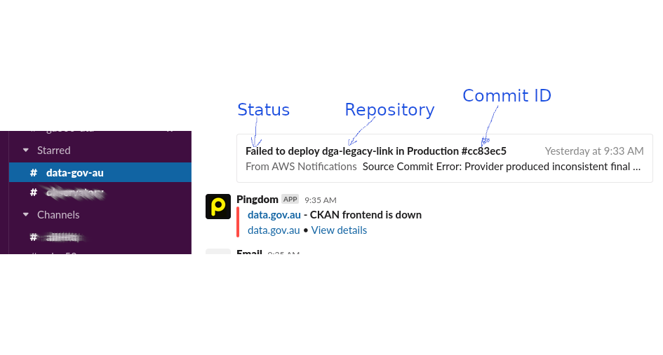
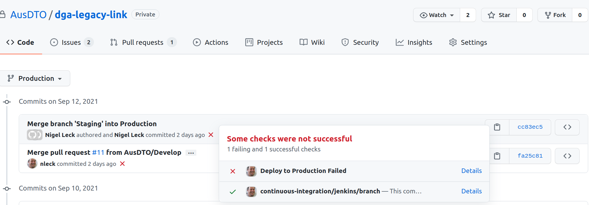
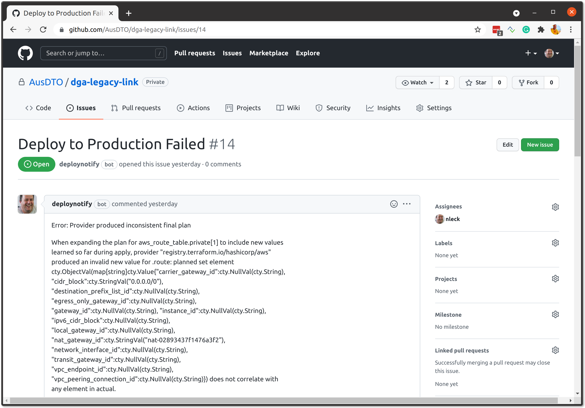

# 🟩 Cross account deployment of docker images and Terraform IaC scripts 
## Summary
Following the [AWS "well-architected multi-account" strategy](https://aws.amazon.com/organizations/getting-started/best-practices/), each workload is in a different Organizational Unit ( AWS Account). A "workload" ( dataGov ) has different phases in the [Systems Development Life Cycle](https://en.wikipedia.org/wiki/Systems_development_life_cycle) (SDLC). Generally, we break these phases up into other Organizational Units ( AWS Accounts).

For each "workload", we would have a "pipeline" account (Jenkins), a scratch/development account, staging/QA and production. Each account should be as isolated as possible. There should be no cross-account access from the lower accounts ( Staging/QA, development) to the production accounts.

The Jenkin workflow ( in the "pipeline" account) builds docker images and Infrastructure as Code scripts (Terraform), then runs automated tests. The GitHub branch workflow controls the target account. 

The GitHub branch for a repository "Develop" will target the AWS Account "sts-scratch", the branch "Staging" will target "sts-non-prod", and the branch "Production" will target "sts-production".

The Jenkins workflow ( AWS "pipeline" account) will build, publish and tag Docker images to an [Elastic Container Registry](https://aws.amazon.com/ecr/) (ECR) within the "pipeline" account with NO access to any other AWS account.

In each Organizational Unit ( AWS Account), there is a "deploy" Lambda, which monitors the ECR within the "pipeline" account for changes to Docker images which are tags for deployment to the current account.

The mapping of the AWS account, "area" tag and Registery are passed to the "deploy" Lambda as a configuration variable. The account mapping configuration is in a separate GitHub repository.


## The Terraform IaC (Infrastructure a Code) script generates.
1. Lambda "deploy"
2. IAM Role & policy for the Lamdba "deploy".
3. Cloud Watch group for the Lambda "deploy".
4. Event rule triggers the "deploy" Lambda each minute during business hours.
5. IAM Role & policy for the Infrastructure as Code (IaC) "deploy instance".
6. Launch template for the IaC "deploy instance".
7. Autoscale group for the "deploy instance" ( prevent multiple from running).
8. Autoscale group schedule to remove "dead" deployments.

## GitHub integration 




```bash
ssh-keygen -t rsa -b 4096 -m PEM -f ~/.ssh/gitRS256.key
# Don't add passphrase
openssl rsa -in ~/.ssh/gitRS256.key -pubout -outform PEM -out ~/.ssh/gitRS256.pem.pub
cat ~/.ssh/gitRS256.key | base64 > ~/.ssh/gitRS256.b64
echo "Public Key"
cat ~/.ssh/gitRS256.pub
```
## References
https://aws.amazon.com/blogs/containers/sharing-amazon-ecr-repositories-with-multiple-accounts-using-aws-organizations/
https://alex.kaskaso.li/post/pull-based-pipelines
https://www.weave.works/blog/why-is-a-pull-vs-a-push-pipeline-important